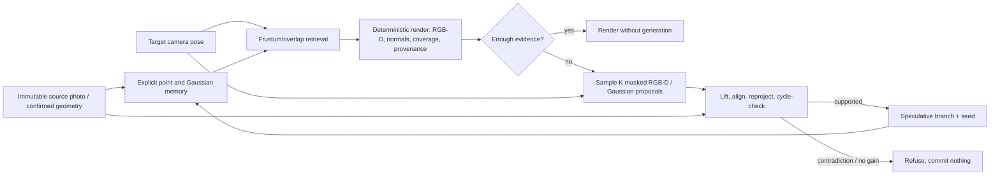

# Camera-conditioned point continuation

Research decision and implementation plan, verified 2026-08-23.

## Decision

Do not build GaussianPerl around literal next-point autoregression or around
GaussianGPT. Keep the useful LLM analogy at the system boundary:

> retrieved scene state + target camera + coverage mask -> sampled 3D continuation

The continuation unit should be a masked 3D region, a small group of posed
keyframes, or an unordered set/scale of Gaussians. Raw point ordering is
arbitrary, produces very long sequences, and compounds quantization and
exposure errors. [PointNSP](https://arxiv.org/abs/2503.08594) and
[MAR-3D](https://arxiv.org/html/2503.20519) both support next-scale/set-like
generation instead.

The product architecture should combine:

1. an immutable, photograph-exact source representation;
2. a deterministic nearby-view scaffold;
3. a camera-conditioned stochastic guesser only where evidence ends;
4. several speculative branches rather than an averaged answer;
5. geometric and provenance gates before any proposal becomes scene memory;
6. explicit refusal when the evidence does not support a commit.

## GaussianGPT: what is true and what is not

GaussianGPT is real TUM/Niessner-group work and an ECCV 2026 Oral. The primary
sources are the [paper](https://arxiv.org/html/2603.26661v2),
[official repository](https://github.com/nicolasvonluetzow/GaussianGPT), and
[ECCV program entry](https://eccv.ecva.net/virtual/2026/oral/6169).

| Claim | Verification |
|---|---|
| "A VQ-VAE turns Gaussians into tokens" | Close, but imprecise. It is a sparse 3D convolutional autoencoder with lookup-free quantization (LFQ), not a conventional learned-codebook VQ-VAE. |
| "It predicts splats one by one" | No. It predicts alternating latent occupied-voxel locations and feature codes in fixed xyz order. A decoder emits Gaussians afterward. |
| "The committed scene is the prompt" | Only in a constrained sense. Completion conditions on a causal prefix of an already-tokenized 3D scene, typically a spatial fraction. It does not take a photograph, camera query, arbitrary visibility mask, or disocclusion as input. |
| "About 350M parameters" | Reasonable shorthand. The scene transformer is 24 layers, width 1024, 16 heads, about 327M static parameters. |
| "Samples like an LLM" | Yes. Temperature, top-k, and top-p sampling are exposed. |
| "Synthetic interiors only" | The released scene weights are based on 3D-FRONT / Aria Synthetic Environments. The paper also reports a small ScanNet++ fine-tune on 895 real scenes, but those real-scene weights are not released. |
| "About 5.2 GB of checkpoints" | Approximately true for one released scene autoencoder/transformer pair. Code is MIT; no separate broad product grant for every checkpoint artifact should be inferred without explicit weight terms. |
| "Code pushed yesterday" | Misleading as a maturity claim. The repository history shows the code and weights arriving in June/July 2026; the recent August update was reference/metadata work. See the [commit history](https://github.com/nicolasvonluetzow/GaussianGPT/commits/main/). |

The reported results are mixed, not simply bad. It improves several appearance,
layout, completion-consistency, and chair-distribution metrics. It is slower and
heavier than the cited L3DG diffusion baseline, and some unconditional scene
geometry metrics are worse. The paper's real-world appendix explicitly reports
lost high-frequency detail, noisy geometry/Gaussians, and incomplete scans that
the autoencoder cannot reconstruct faithfully. On one A100 it reports 78.1 s
for unconditional scene generation and 38.9 s with 50% context. GaussianGPT
therefore proves a mechanism under a constrained 3D prior; it does not prove
photographic, camera-conditioned next-view completion.

## Frontier systems that change the answer

The old claim that nobody has built photo-conditioned, camera-queryable scene
completion is no longer correct. The exact *product-ready combination* is still
missing.

| System | Relevance | Practical decision |
|---|---|---|
| [SHARP](https://arxiv.org/html/2512.10685) / [code](https://github.com/apple/ml-sharp) | One photo to about 1.18M metric 3D Gaussians; official prediction supports CPU, CUDA, and MPS. Strong photograph-preserving nearby-view scaffold. | Use as a research Stage-0 benchmark. It is deterministic, intended for nearby motion, its supplied renderer is CUDA-only, and the [model license](https://raw.githubusercontent.com/apple/ml-sharp/main/LICENSE_MODEL) is research-only and excludes product use. |
| [Spatia](https://arxiv.org/html/2512.15716) / [code](https://github.com/ZhaoJingjing713/Spatia) | Persistent point memory is rendered at requested cameras; Wan diffusion fills gaps; MapAnything/SLAM writes geometry back. This is the closest released state-query-guess-update loop. | First remote-GPU research backend. Apache-2.0 code, CC BY-SA 4.0 released adapter weights, CUDA/ROCm-class stack. Treat its reconstructed output as proposals, never as automatic truth. |
| [PixWorld](https://arxiv.org/html/2607.05373) / [repository](https://github.com/SensenGao/PixWorld) | Closest eventual model: stochastic posed views, depth, and pixel-aligned Gaussians with differentiable-render supervision. | Design an adapter, do not depend on it. Inference code, weights, distilled model, and repository license are still absent/"coming soon." |
| [VMem](https://arxiv.org/html/2506.18903) / [code](https://github.com/runjiali-rl/vmem) | Surfel-indexed view retrieval, sampled target views, and CUT3R pointmaps written back to memory. | Useful released comparison for explicit memory; not a lightweight local backend. |
| [Mirage](https://arxiv.org/html/2606.09828) / [code](https://github.com/microsoft/LatentSpatialMemory) | Reads and writes world-space video latents instead of a large RGB cache. | Later acceleration only. MIT code, but no pretrained Mirage VACE/LoRA checkpoint is published. Explicit geometry remains authoritative. |
| [Lyra 2.0](https://arxiv.org/html/2604.13036) / [code](https://github.com/nv-tlabs/lyra/tree/main/Lyra-2) | Single image + camera path -> geometry-retrieved long video -> 3DGS. | Architectural evidence, not a dependency: 14B, H100-class, and production use is barred by its model license. |
| [HY-World 2.0](https://github.com/Tencent-Hunyuan/HY-World-2.0) | Full photo/text-to-panorama-to-world-to-3DGS pipeline. | Too large and legally awkward: multi-GPU components and a geographically/product-restricted [community license](https://raw.githubusercontent.com/Tencent-Hunyuan/HY-World-2.0/main/License.txt). |
| [CUT3R](https://arxiv.org/abs/2501.12387) / [code](https://github.com/CUT3R/CUT3R) | Persistent learned state can be queried at a virtual camera to regress a pointmap. | Confirms the queryable-state concept. Deterministic regression cannot represent multiple sharp hidden-region hypotheses; code is CC BY-NC-SA. |

[One2Scene](https://arxiv.org/html/2602.19766) also performs single-photo
stochastic scene/view completion and 3DGS reconstruction, but its released
pipeline is eight-GPU oriented and the repository states no license. World
models such as [GEN3C](https://openaccess.thecvf.com/content/CVPR2025/html/Ren_GEN3C_3D-Informed_World-Consistent_Video_Generation_with_Precise_Camera_Control_CVPR_2025_paper.html),
[Matrix-Game 3.0](https://arxiv.org/abs/2604.08995),
[WorldMem](https://arxiv.org/abs/2504.12369), and
[Voyager](https://arxiv.org/abs/2506.04225) independently reinforce the same
memory/retrieval/render/generate loop, but their primary output is video rather
than a small, provenance-safe editable Gaussian scene.

## Architecture for GaussianPerl

Rules:

- Observed source texels are immutable. Temperature may affect only unobserved
  masks.
- A generated proposal is speculative even after it passes geometric checks.
  Only later real evidence can promote it to confirmed.
- Speculative branches do not veto each other. Only source/confirmed witnesses
  may reject a candidate.
- Select one coherent sample for a branch; never average mutually exclusive
  geometry into a blurry mean.
- Cache eviction is a rendering concern, not memory deletion.
- A geometry gate can prove contradiction or lack of coverage. It cannot prove
  that a plausible unseen shirt, face, tree, or building is the true one.

## Portrait-specific path

The test image contains a foreground person and a static outdoor scene. A
generic static world model will either bake the actor into the landscape or
regenerate identity and limbs as the camera moves. Keep two representations:

- static world: grass, trees, horizon, sky, and other scene geometry;
- actor: a separately masked, canonical human/avatar representation composited
  into the world.

[LHM](https://github.com/aigc3d/LHM) is the most practical deterministic
single-image Gaussian-avatar research baseline (Apache-2.0 code, CC BY-NC 4.0
weights, roughly 24 GB VRAM for the 1B model). For alternative unseen backs,
[SiTH](https://github.com/SiTH-Diffusion/SiTH) explicitly samples several back
views, while [Human-3Diffusion](https://github.com/YuxuanSnow/Human3Diffusion)
samples coupled multi-view/3D completions. None can recover factual unseen
clothing, hair, logos, or anatomy from one photograph; those outputs are
plausible hypotheses. A side/back photograph or short turntable is required
when truth matters.

## What is implemented now

- `src/pipeline/point-prompt.js` provides a camera-queryable binary prompt,
  non-evicting CPU memory, dense numeric point/source IDs, arbitrary color and
  depth resolutions, per-point trust/uncertainty, and source/confirmed/
  speculative state.
- `src/pipeline/points.js` serializes anchors into world points, classifies
  them against witnesses, rejects empty copies/no-gain/contradictory proposals,
  and chooses one coherent stochastic sample without averaging.
- `src/main.js` now commits the real source observation and accepted generated
  anchors to that memory. GPU eviction no longer implies loss of model context.
  The nearest retained views are reloaded into the fixed-size GPU cache as the
  camera moves. Only source/confirmed memory acts as veto evidence.
- `e2e/run-photo-eval.mjs` is a deterministic, non-writing, offline evaluator
  for arbitrary local photos. It reports source exactness, camera coverage,
  confidence, base provenance, point-gate evidence, and prompt composition.

This is the context and safety substrate, not yet a learned point guesser. The
current live completion backend remains 2D fill followed by depth alignment.

## Supplied-image results

Input: `Khomami_JT-09556.jpg.avif`, 3072 x 2047; evaluated at 548 x 365 with
semantic models disabled.

| Camera yaw | Unexplained visible pixels |
|---:|---:|
| 0 degrees | 0.00% |
| +/-5 degrees | 1.93% |
| +/-10 degrees | 6.26% |
| +/-15 degrees | 10.73% |

At home, RGB is byte-exact: zero changed channels, zero holes, confidence 1.0,
and source provenance 1.0.

A forced classical completion at +10 degrees closed visible holes from 6.26%
to 0 and padded-anchor holes from 22.32% to 3.06%. The new point gate found
12,410 source-supported points, 6,970 unobserved points, and zero geometric
contradictions, so it accepted the candidate as a speculative branch. This is
only a plumbing result: mean source provenance fell from 0.9511 to 0.5551 and
mean confidence fell from 0.9338 to 0.9217. Closing a mask is not evidence that
the invented content is semantically correct.

Apple SHARP was also run directly on the AVIF on an M2 Max with 32 GB unified
memory using the official checkpoint and MPS. It produced a valid binary PLY
with 1,179,648 Gaussians (66,061,086 bytes). The warm CLI took 18.49 s
end-to-end; SHARP logged 3.38 s for inference, peaked near 5.57 GiB RSS, and
used no swap. A cached CPU control took 43.33 s end-to-end and 28.91 s for its
inference segment. This disproves the
"zero Apple-Silicon port" statement, but the research-only model license means
the checkpoint is a benchmark, not shippable product code. GaussianPerl does
not currently have a general 3DGS PLY renderer, so the PLY has not been silently
treated as a renderable app asset. The AVIF has no focal-length EXIF, so SHARP
warned and assumed 30 mm; that makes its absolute metric scale less reliable for
this particular photograph.

One image cannot score the correctness of its unseen back. It can test source
identity, silhouette behavior, provenance, repeatability, and refusal. Factual
completion accuracy requires held-out views.

## Ranked build plan

1. **Add a standard 3DGS PLY import/render path.** Compare the current RGB-D
   lift with SHARP locally, while keeping the restricted checkpoint outside
   product dependencies.
2. **Define a versioned guesser RPC.** Input is the point prompt, target pose,
   rendered RGB-D/normals/coverage, mask, branch ID, seed, temperature, and K.
   Output is K RGB-D/normal or Gaussian proposals plus uncertainty.
3. **Benchmark Spatia remotely.** Intercept its generated frames and geometry
   before its internal memory update. Pass them through GaussianPerl's gate and
   retain them only as speculative branches.
4. **Add branch lifecycle.** Revisit the same pose deterministically within a
   branch; retain seeds; allow new real photos to promote or reject geometry.
5. **Separate actor and static scene.** Freeze the portrait for tiny parallax,
   then evaluate LHM plus several sampled back hypotheses without fusing the
   actor into the landscape map.
6. **Prepare a PixWorld-style adapter/training path.** The preferred learned
   output is direct pixel-aligned Gaussians or masked Gaussian sets, trained
   with differentiable rendering and held-out-view supervision—not a raw point
   sentence.
7. **Optimize only after correctness.** A Mirage-like latent cache can speed
   generation, but explicit point/Gaussian state remains the source of truth
   for provenance and contradiction checks.

## Acceptance tests

- byte-exact source view and zero mutation of observed texels;
- known-region PSNR/SSIM/LPIPS plus depth/reprojection consistency;
- hole coverage, false-commit rate, contradiction count, and abstention
  risk/coverage;
- best-of-K and mean held-out-view quality, with diversity restricted to
  unobserved masks;
- return-to-home drift and long-rollout revisit consistency;
- separate human identity, silhouette, garment, and joint consistency metrics;
- held-out multiview evaluation on scene data such as DL3DV, ScanNet++,
  RealEstate10K, and Tanks and Temples, plus licensed human multiview data.

The deciding metric is not whether the system always fills. It is whether it
preserves evidence, samples plausible alternatives only where evidence ends,
and refuses unsafe commits.
